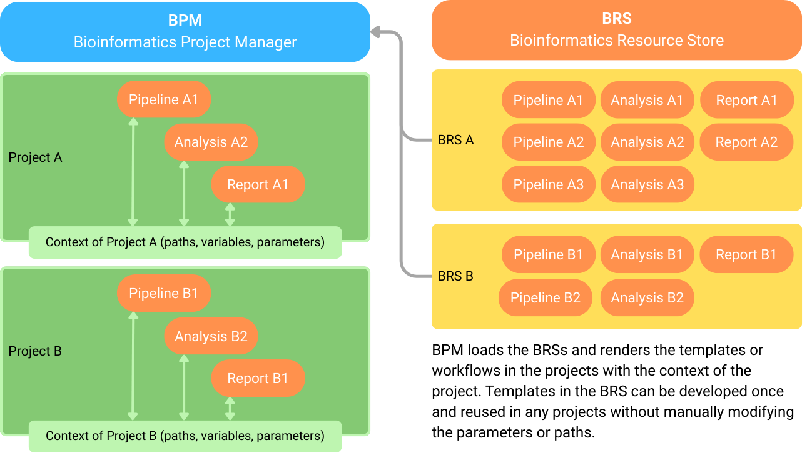

# BPM — Bioinformatics Project Manager

Write once, render anywhere — in any project context.

BPM is a lightweight CLI that sits above your scripts and pipelines. It organizes projects, renders reusable templates from Bioinformatics Resource Stores (BRS), runs their entries, and publishes structured results — all while keeping state in plain files you control.

## What BPM Is (and Isn’t)

- Is: a management layer for projects and reusable templates; BRS are catalogs you own.
- Isn’t: a workflow engine, a LIMS, or a cloud service — it complements those.
- Organize, render, run, publish — without changing your workflows.

## Why BPM (Unique Niche)

- Reuse your best work — across datasets, teams, and sites.
- One template, many projects — consistent, reproducible renders.
- Project context baked into rendering (project_path → ctx.project_dir).
- Transparency by default: project.yaml and stores.yaml are human‑readable and versionable.

## How You Use It (at a glance)

- Add/activate a BRS catalog for your lab or facility.
- Create (or open) a project folder.
- Render → Run → Publish a template; BPM handles paths, parameters, and outputs in context.

## Core Layers

- Getting Started — quick install and first run.
- Concepts — projects & paths, templates & rendering, stores & cache, context (ctx).
- How‑To — task‑focused guides (project vs ad‑hoc, run/publish, manage stores).
- CLI — command guides for project, template, resource, workflow.
- Reference — file formats, context API, exit codes.
- BRS — what a resource store is and how templates are organized.

## Compatibility & Fit

- Use Nextflow/Snakemake inside BPM templates if you like — BPM won’t get in the way.
- Hooks and resolvers adapt to environments and publish structured results back to the project.

In short: organize, reuse, and share analysis the right way — with minimal ceremony.
